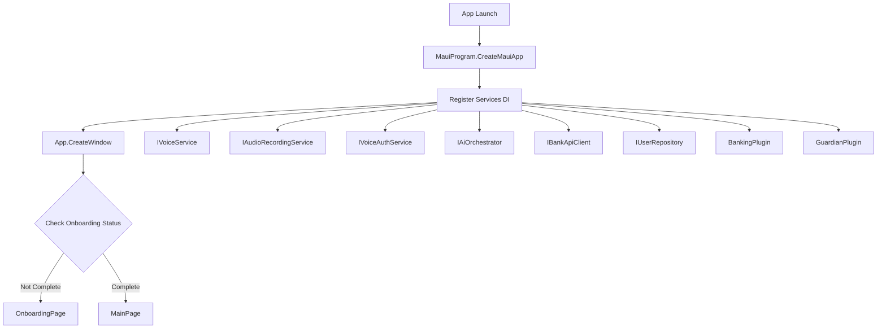

# 🏗️ Boses Complete Architecture Flowchart

## 📊 System Overview

```
┌─────────────────────────────────────────────────────────────────┐
│                        BOSES APPLICATION                         │
│                  Voice-First Accessibility Platform              │
└─────────────────────────────────────────────────────────────────┘
                                 │
                    ┌────────────┴────────────┐
                    │                         │
            ┌───────▼────────┐       ┌───────▼────────┐
            │  First Launch  │       │ Returning User │
            │   (Onboarding) │       │   (Main App)   │
            └────────────────┘       └────────────────┘
```

---

## 🚀 Application Startup Flow



### **Detailed Startup Sequence**

```
1. Program Entry Point
   └─> MauiProgram.cs
       └─> CreateMauiApp()
           ├─> UseMauiApp<App>()
           ├─> ConfigureFonts()
           ├─> ConfigureDataServices()
           │   ├─> AddDbContext<BosesDbContext>()
           │   └─> AddSingleton<IUserRepository, UserRepository>()
           ├─> AddSingleton<IVoiceService, VoiceService>()
           ├─> AddSingleton<IAudioRecordingService, AudioRecordingService>()
           ├─> AddSingleton<IVoiceAuthService, RealVoiceAuthService>()
           ├─> AddSingleton<IAiOrchestrator, AiOrchestratorService>()
           ├─> AddSingleton<IBankApiClient, MockBrankasApiClient>()
           ├─> AddSingleton<BankingPlugin>()
           ├─> AddSingleton<GuardianPlugin>()
           ├─> AddTransient<MainViewModel>()
           ├─> AddTransient<MainPage>()
           ├─> AddTransient<VoiceRegistrationViewModel>()
           ├─> AddTransient<VoiceRegistrationPage>()
           ├─> AddTransient<OnboardingViewModel>()
           └─> AddTransient<OnboardingPage>()

2. App Initialization
   └─> App.xaml.cs
       └─> CreateWindow(IActivationState)
           ├─> Get IUserRepository from DI
           ├─> CheckOnboardingStatus()
           │   └─> userRepository.GetAllUsersAsync()
           │       └─> Check HasCompletedOnboarding
           └─> Return Window
               ├─> If Not Onboarded: NavigationPage(OnboardingPage)
               └─> If Onboarded: NavigationPage(MainPage)
```

---

## 📋 Complete Class Hierarchy

### **1. Data Layer**

```
Core/Data/
├── Models/
│   ├── UserProfile.cs
│   │   ├── Properties:
│   │   │   ├── Id: int
│   │   │   ├── FullName: string
│   │   │   ├── PhoneNumber: string
│   │   │   ├── Email: string
│   │   │   ├── DateOfBirth: DateTime?
│   │   │   ├── UserType: UserType (enum)
│   │   │   ├── AccessibilityNeeds: AccessibilityNeeds (flags)
│   │   │   ├── PwdCategory: PwdCategory (enum)
│   │   │   ├── PwdIdNumber: string
│   │   │   ├── SeniorCitizenIdNumber: string
│   │   │   ├── VoicePrintData: string
│   │   │   ├── IsVoiceAuthEnabled: bool
│   │   │   ├── HasCompletedOnboarding: bool
│   │   │   ├── VoiceOnlyMode: bool
│   │   │   ├── GuardianPhoneNumber: string
│   │   │   ├── GuardianName: string
│   │   │   ├── AccessibilitySettings: string
│   │   │   └── LinkedBankAccounts: string
│   │   └── Computed Properties:
│   │       ├── Age: int?
│   │       ├── IsSenior: bool
│   │       └── HasVisualImpairment: bool
│   │
│   └── UserType.cs
│       ├── UserType (enum)
│       │   ├── None = 0
│       │   ├── Senior = 1
│       │   ├── PWD = 2
│       │   └── Both = 3
│       ├── AccessibilityNeeds (flags)
│       │   ├── None = 0
│       │   ├── VisualImpairment = 1
│       │   ├── HearingImpairment = 2
│       │   ├── MotorImpairment = 4
│       │   └── CognitiveImpairment = 8
│       └── PwdCategory (enum)
│           ├── None
│           ├── Mobility
│           ├── Visual
│           ├── Hearing
│           ├── Cognitive
│           ├── Psychosocial
│           └── Multiple
│
└── BosesDbContext.cs
    ├── Inherits: DbContext
    ├── DbSet<UserProfile> UserProfiles
    └── Methods:
        └── OnModelCreating(ModelBuilder)
```

### **2. Interface Layer**

```
Core/Interfaces/
├── IUserRepository.cs
│   ├── GetUserByIdAsync(int id): Task<UserProfile?>
│   ├── GetUserByPhoneAsync(string phone): Task<UserProfile?>
│   ├── GetAllUsersAsync(): Task<IEnumerable<UserProfile>>
│   ├── CreateUserAsync(UserProfile): Task<UserProfile>
│   ├── UpdateUserAsync(UserProfile): Task<UserProfile>
│   ├── DeleteUserAsync(int id): Task<bool>
│   ├── UserExistsAsync(string phone): Task<bool>
│   └── SaveChangesAsync(): Task
│
├── IVoiceService.cs
│   ├── StartListeningAsync(): Task<bool>
│   ├── StopListeningAsync(): Task<string>
│   ├── SpeakAsync(string text, CancellationToken): Task
│   ├── IsListening: bool
│   ├── SimulationMode: bool
│   └── SetSimulatedInput(string): void
│
├── IAudioRecordingService.cs
│   ├── RequestPermissionsAsync(): Task<bool>
│   ├── StartRecordingAsync(): Task<bool>
│   ├── StopRecordingAsync(): Task<byte[]>
│   ├── IsRecording: bool
│   └── RecordingDuration: TimeSpan
│
├── IVoiceAuthService.cs
│   ├── RegisterVoicePrintAsync(int userId, byte[] audio): Task<string>
│   ├── VerifyVoiceAsync(int userId, byte[] audio, string print): Task<bool>
│   ├── CalculateSimilarityAsync(byte[] s1, byte[] s2): Task<double>
│   ├── SimulationMode: bool
│   └── SetSimulatedAuthResult(bool): void
│
└── IAiOrchestrator.cs
    ├── ProcessCommandAsync(string input, int userId): Task<string>
    ├── InitializeAsync(): Task
    ├── RequiresGuardianVerificationAsync(string cmd): Task<bool>
    ├── ExtractTransactionIntentAsync(string cmd): Task<TransactionIntent?>
    └── SimulationMode: bool
```

### **3. Service Layer**

```
Core/Services/
├── UserRepository.cs
│   ├── Implements: IUserRepository
│   ├── Dependencies:
│   │   ├── BosesDbContext? _dbContext
│   │   ├── string _jsonFilePath
│   │   └── bool _useJsonFallback
│   ├── Constructor(BosesDbContext?, string, bool)
│   └── Methods:
│       ├── GetUserByIdAsync(int): Task<UserProfile?>
│       ├── GetUserByPhoneAsync(string): Task<UserProfile?>
│       ├── GetAllUsersAsync(): Task<IEnumerable<UserProfile>>
│       ├── CreateUserAsync(UserProfile): Task<UserProfile>
│       ├── UpdateUserAsync(UserProfile): Task<UserProfile>
│       ├── DeleteUserAsync(int): Task<bool>
│       ├── UserExistsAsync(string): Task<bool>
│       ├── SaveChangesAsync(): Task
│       ├── InitializeJsonStorage(): void
│       ├── LoadJsonCache(): void
│       └── SaveJsonCache(): void
│
├── VoiceService.cs
│   ├── Implements: IVoiceService
│   ├── Fields:
│   │   ├── bool _isListening
│   │   ├── string _simulatedInput
│   │   └── List<string> _demoResponses
│   └── Methods:
│       ├── StartListeningAsync(): Task<bool>
│       ├── StopListeningAsync(): Task<string>
│       ├── SpeakAsync(string, CancellationToken): Task
│       └── SetSimulatedInput(string): void
│
├── AudioRecordingService.cs
│   ├── Implements: IAudioRecordingService
│   ├── Fields:
│   │   ├── bool _isRecording
│   │   ├── DateTime _recordingStartTime
│   │   ├── List<byte> _audioBuffer
│   │   └── object _lock
│   └── Methods:
│       ├── RequestPermissionsAsync(): Task<bool>
│       ├── StartRecordingAsync(): Task<bool>
│       ├── StopRecordingAsync(): Task<byte[]>
│       └── AddAudioData(byte[]): void
│
├── RealVoiceAuthService.cs
│   ├── Implements: IVoiceAuthService
│   ├── Dependencies:
│   │   └── IAudioRecordingService _audioRecordingService
│   ├── Constructor(IAudioRecordingService)
│   └── Methods:
│       ├── RegisterVoicePrintAsync(int, byte[]): Task<string>
│       ├── VerifyVoiceAsync(int, byte[], string): Task<bool>
│       ├── CalculateSimilarityAsync(byte[], byte[]): Task<double>
│       ├── ExtractVoiceFeatures(byte[]): float[]
│       ├── NormalizeFeatures(float[]): void
│       ├── CalculateCosineSimilarity(float[], float[]): double
│       ├── GenerateMockVoiceVector(byte[]): float[]
│       └── SetSimulatedAuthResult(bool): void
│
└── AiOrchestratorService.cs
    ├── Implements: IAiOrchestrator
    ├── Dependencies:
    │   ├── Kernel? _kernel
    │   ├── IUserRepository _userRepository
    │   └── bool _isInitialized
    ├── Constructor(IUserRepository)
    └── Methods:
        ├── InitializeAsync(): Task
        ├── ProcessCommandAsync(string, int): Task<string>
        ├── ProcessCommandSimulatedAsync(string, int): Task<string>
        ├── RequiresGuardianVerificationAsync(string): Task<bool>
        ├── ExtractTransactionIntentAsync(string): Task<TransactionIntent?>
        └── ExtractAmount(string): decimal?
```

### **4. Network Layer**

```
Core/Network/
├── Interfaces/
│   └── IBankApiClient.cs
│       ├── GetBalanceAsync(string accountId): Task<BankAccountBalance>
│       ├── GetTransactionsAsync(string, int): Task<IEnumerable<BankTransaction>>
│       ├── TransferFundsAsync(TransferRequest): Task<TransferResult>
│       ├── GetLinkedAccountsAsync(int userId): Task<IEnumerable<BankAccount>>
│       ├── VerifyAccountAsync(string): Task<bool>
│       └── SimulationMode: bool
│
└── Services/
    └── MockBrankasApiClient.cs
        ├── Implements: IBankApiClient
        ├── Fields:
        │   ├── Random _random
        │   ├── Dictionary<string, BankAccount> _mockAccounts
        │   └── List<BankTransaction> _mockTransactions
        ├── Constructor()
        └── Methods:
            ├── InitializeMockData(): void
            ├── GetBalanceAsync(string): Task<BankAccountBalance>
            ├── GetTransactionsAsync(string, int): Task<IEnumerable<BankTransaction>>
            ├── TransferFundsAsync(TransferRequest): Task<TransferResult>
            ├── GetLinkedAccountsAsync(int): Task<IEnumerable<BankAccount>>
            └── VerifyAccountAsync(string): Task<bool>
```

### **5. Plugin Layer (Semantic Kernel)**

```
Modules/Plugins/
├── BankingPlugin.cs
│   ├── Dependencies:
│   │   ├── IBankApiClient _bankApiClient
│   │   └── IUserRepository _userRepository
│   ├── Constructor(IBankApiClient, IUserRepository)
│   └── Kernel Functions:
│       ├── [KernelFunction("get_account_balance")]
│       │   GetAccountBalanceAsync(int userId, string? accountId): Task<string>
│       ├── [KernelFunction("get_recent_transactions")]
│       │   GetRecentTransactionsAsync(int userId, int limit): Task<string>
│       ├── [KernelFunction("transfer_funds")]
│       │   TransferFundsAsync(int userId, decimal amount, string recipient, string purpose): Task<string>
│       └── [KernelFunction("calculate_pwd_discount")]
│           CalculatePwdDiscountAsync(decimal price, string category): Task<string>
│
└── GuardianPlugin.cs
    ├── Dependencies:
    │   ├── IUserRepository _userRepository
    │   └── Dictionary<string, GuardianVerificationRequest> _pendingVerifications
    ├── Constructor(IUserRepository)
    └── Kernel Functions:
        ├── [KernelFunction("check_transaction_risk")]
        │   CheckTransactionRiskAsync(int userId, decimal amount, string recipient, string desc): Task<string>
        ├── [KernelFunction("request_guardian_verification")]
        │   RequestGuardianVerificationAsync(int userId, string details): Task<string>
        ├── [KernelFunction("verify_guardian_code")]
        │   VerifyGuardianCodeAsync(string verificationId, string code): Task<string>
        ├── [KernelFunction("detect_scam_patterns")]
        │   DetectScamPatternsAsync(string message): Task<string>
        └── CalculateRiskScore(decimal, string, string): int
```

---

## 🎨 Presentation Layer

### **ViewModels**

```
Presentation/ViewModels/
├── MainViewModel.cs
│   ├── Inherits: ObservableObject
│   ├── Dependencies:
│   │   ├── IVoiceService _voiceService
│   │   ├── IAiOrchestrator _aiOrchestrator
│   │   ├── IVoiceAuthService _voiceAuthService
│   │   └── IUserRepository _userRepository
│   ├── Observable Properties:
│   │   ├── StatusMessage: string
│   │   ├── IsListening: bool
│   │   ├── IsBusy: bool
│   │   ├── CurrentUserName: string
│   │   ├── IsVoiceAuthEnabled: bool
│   │   ├── LastTranscription: string
│   │   ├── AiResponse: string
│   │   └── ConversationHistory: ObservableCollection<ConversationMessage>
│   ├── Constructor(IVoiceService, IAiOrchestrator, IVoiceAuthService, IUserRepository)
│   └── Commands:
│       ├── InitializeAsync(): Task
│       ├── [RelayCommand] ToggleListeningAsync(): Task
│       ├── StartListeningAsync(): Task
│       ├── StopListeningAsync(): Task
│       ├── ProcessVoiceCommandAsync(string): Task
│       ├── [RelayCommand] SimulateVoiceInputAsync(string): Task
│       ├── [RelayCommand] ToggleSimulationModeAsync(): Task
│       ├── [RelayCommand] ClearConversation(): void
│       ├── [RelayCommand] RegisterVoiceAsync(): Task
│       └── AddMessage(string, string, bool): void
│
├── VoiceRegistrationViewModel.cs
│   ├── Inherits: ObservableObject
│   ├── Dependencies:
│   │   ├── IAudioRecordingService _audioRecordingService
│   │   ├── IVoiceAuthService _voiceAuthService
│   │   ├── IUserRepository _userRepository
│   │   └── IVoiceService _voiceService
│   ├── Observable Properties:
│   │   ├── StatusMessage: string
│   │   ├── IsRecording: bool
│   │   ├── IsBusy: bool
│   │   ├── CurrentSample: int
│   │   ├── TotalSamples: int
│   │   ├── Progress: double
│   │   ├── InstructionText: string
│   │   ├── IsComplete: bool
│   │   └── RecordingDuration: string
│   ├── Fields:
│   │   ├── List<byte[]> _voiceSamples
│   │   ├── int _userId
│   │   └── Timer? _durationTimer
│   ├── Constructor(IAudioRecordingService, IVoiceAuthService, IUserRepository, IVoiceService)
│   └── Commands:
│       ├── InitializeAsync(int userId): Task
│       ├── [RelayCommand] ToggleRecordingAsync(): Task
│       ├── StartRecordingAsync(): Task
│       ├── StopRecordingAsync(): Task
│       ├── CompleteRegistrationAsync(): Task
│       ├── [RelayCommand] ResetRegistrationAsync(): Task
│       ├── [RelayCommand] CloseAsync(): Task
│       ├── CombineAudioSamples(List<byte[]>): byte[]
│       ├── StartDurationTimer(): void
│       └── StopDurationTimer(): void
│
└── OnboardingViewModel.cs
    ├── Inherits: ObservableObject
    ├── Dependencies:
    │   ├── IVoiceService _voiceService
    │   ├── IAudioRecordingService _audioRecordingService
    │   ├── IVoiceAuthService _voiceAuthService
    │   └── IUserRepository _userRepository
    ├── Observable Properties:
    │   ├── CurrentStep: int
    │   ├── StatusMessage: string
    │   ├── IsBusy: bool
    │   ├── VoiceOnlyMode: bool
    │   ├── FullName: string
    │   ├── DateOfBirth: DateTime
    │   ├── PhoneNumber: string
    │   ├── IsSenior: bool
    │   ├── IsPwd: bool
    │   ├── PwdCategory: PwdCategory
    │   ├── PwdIdNumber: string
    │   ├── SeniorCitizenIdNumber: string
    │   ├── HasVisualImpairment: bool
    │   ├── HasHearingImpairment: bool
    │   ├── HasMotorImpairment: bool
    │   ├── HasCognitiveImpairment: bool
    │   ├── GuardianName: string
    │   ├── GuardianPhone: string
    │   ├── IsRecording: bool
    │   └── RecordingInstruction: string
    ├── Fields:
    │   ├── List<byte[]> _voiceSamples
    │   ├── int _voiceSampleCount
    │   └── CancellationTokenSource? _voiceGuidanceCts
    ├── Constructor(IVoiceService, IAudioRecordingService, IVoiceAuthService, IUserRepository)
    └── Commands:
        ├── InitializeAsync(): Task
        ├── StartOnboardingAsync(): Task
        ├── [RelayCommand] UserCanSeeAsync(): Task
        ├── [RelayCommand] UserCannotSeeAsync(): Task
        ├── AskUserTypeAsync(): Task
        ├── [RelayCommand] SelectSeniorAsync(): Task
        ├── [RelayCommand] SelectPwdAsync(): Task
        ├── [RelayCommand] SelectBothAsync(): Task
        ├── AskPwdCategoryAsync(): Task
        ├── [RelayCommand] SelectPwdCategoryAsync(string): Task
        ├── ProceedToPersonalInfoAsync(): Task
        ├── [RelayCommand] ContinueToVoiceRegistrationAsync(): Task
        ├── StartVoiceRegistrationAsync(): Task
        ├── StartVoiceOnlyRegistrationAsync(): Task
        ├── RecordVoiceSampleAutomaticallyAsync(): Task
        ├── CompleteOnboardingAsync(): Task
        ├── BuildWelcomeMessage(UserProfile): string
        ├── NavigateToMainAppAsync(): Task
        ├── CombineAudioSamples(List<byte[]>): byte[]
        ├── StartVoiceOnlyOnboardingAsync(): Task
        └── RecordVoiceResponseAsync(): Task<byte[]>
```

### **Views**

```
Presentation/Views/
├── MainPage.xaml / MainPage.xaml.cs
│   ├── Dependencies:
│   │   └── MainViewModel _viewModel
│   ├── Constructor(MainViewModel)
│   └── Lifecycle:
│       └── OnAppearing(): void
│           └── _viewModel.InitializeAsync()
│
├── VoiceRegistrationPage.xaml / VoiceRegistrationPage.xaml.cs
│   ├── Dependencies:
│   │   └── VoiceRegistrationViewModel _viewModel
│   ├── Constructor(VoiceRegistrationViewModel)
│   └── Lifecycle:
│       ├── OnAppearing(): void
│       │   └── _viewModel.InitializeAsync(userId)
│       └── OnDisappearing(): void
│
└── OnboardingPage.xaml / OnboardingPage.xaml.cs
    ├── Dependencies:
    │   └── OnboardingViewModel _viewModel
    ├── Constructor(OnboardingViewModel)
    └── Lifecycle:
        └── OnAppearing(): void
            └── _viewModel.InitializeAsync()
```

### **Converters**

```
Presentation/Converters/
├── InvertedBoolConverter.cs
│   ├── Implements: IValueConverter
│   └── Methods:
│       ├── Convert(object?, Type, object?, CultureInfo): object
│       └── ConvertBack(object?, Type, object?, CultureInfo): object
│
├── EqualToConverter.cs
│   ├── Implements: IValueConverter
│   └── Methods:
│       ├── Convert(object?, Type, object?, CultureInfo): object
│       └── ConvertBack(object?, Type, object?, CultureInfo): object
│
└── BoolToColorConverter.cs (in MainPage.xaml.cs)
    ├── Implements: IValueConverter
    ├── Properties:
    │   ├── TrueColor: Color
    │   └── FalseColor: Color
    └── Methods:
        ├── Convert(object?, Type, object?, CultureInfo): object
        └── ConvertBack(object?, Type, object?, CultureInfo): object
```

---

## 🔄 Complete User Flow Diagrams

### **Flow 1: First-Time User (Onboarding)**

```
┌─────────────────────────────────────────────────────────────────┐
│                     FIRST-TIME USER FLOW                         │
└─────────────────────────────────────────────────────────────────┘

1. App.CreateWindow()
   └─> CheckOnboardingStatus()
       └─> userRepository.GetAllUsersAsync()
           └─> No users found
               └─> Return OnboardingPage

2. OnboardingPage.OnAppearing()
   └─> OnboardingViewModel.InitializeAsync()
       └─> StartOnboardingAsync()
           └─> voiceService.SpeakAsync("Welcome to Boses...")
               └─> Wait 5 seconds or user tap

3. User Interaction: "Can you see?"
   ├─> [YES] UserCanSeeCommand
   │   └─> VoiceOnlyMode = false
   │       └─> AskUserTypeAsync()
   │           └─> voiceService.SpeakAsync("Are you Senior, PWD, or Both?")
   │
   └─> [NO] UserCannotSeeCommand
       └─> VoiceOnlyMode = true
           └─> HasVisualImpairment = true
               └─> StartVoiceOnlyOnboardingAsync()
                   └─> voiceService.SpeakAsync("I will guide you...")

4. User Type Selection
   ├─> SelectSeniorCommand
   │   └─> IsSenior = true
   │       └─> ProceedToPersonalInfoAsync()
   │
   ├─> SelectPwdCommand
   │   └─> IsPwd = true
   │       └─> AskPwdCategoryAsync()
   │           └─> voiceService.SpeakAsync("What type of disability?")
   │
   └─> SelectBothCommand
       └─> IsSenior = true, IsPwd = true
           └─> AskPwdCategoryAsync()

5. PWD Category Selection (if applicable)
   └─> SelectPwdCategoryAsync(category)
       └─> PwdCategory = [Visual/Hearing/Mobility/etc.]
           └─> Set corresponding AccessibilityNeeds flags
               └─> ProceedToPersonalInfoAsync()

6. Personal Information
   └─> User enters: Name, Phone, DOB, Guardian
       └─> ContinueToVoiceRegistrationCommand
           └─> StartVoiceRegistrationAsync()

7. Voice Registration
   ├─> [Visual Mode]
   │   └─> User taps mic button 3 times
   │       ├─> audioRecordingService.StartRecordingAsync()
   │       ├─> Wait 5 seconds
   │       ├─> audioRecordingService.StopRecordingAsync()
   │       └─> Repeat 3 times
   │
   └─> [Voice-Only Mode]
       └─> StartVoiceOnlyRegistrationAsync()
           └─> voiceService.SpeakAsync("Starting in 3, 2, 1...")
               └─> RecordVoiceSampleAutomaticallyAsync()
                   ├─> audioRecordingService.StartRecordingAsync()
                   ├─> Wait 5 seconds (auto)
                   ├─> audioRecordingService.StopRecordingAsync()
                   └─> Repeat 3 times automatically

8. Complete Registration
   └─> CompleteOnboardingAsync()
       ├─> CombineAudioSamples(_voiceSamples)
       ├─> voiceAuthService.RegisterVoicePrintAsync(userId, audio)
       │   └─> ExtractVoiceFeatures(audio)
       │       └─> Return 128-dimensional vector
       ├─> Create UserProfile
       │   ├─> FullName, Phone, DOB
       │   ├─> UserType (Senior/PWD/Both)
       │   ├─> AccessibilityNeeds flags
       │   ├─> PwdCategory
       │   ├─> VoicePrintData
       │   ├─> IsVoiceAuthEnabled = true
       │   ├─> VoiceOnlyMode
       │   └─> HasCompletedOnboarding = true
       ├─> userRepository.CreateUserAsync(user)
       ├─> BuildWelcomeMessage(user)
       ├─> voiceService.SpeakAsync(welcomeMessage)
       └─> NavigateToMainAppAsync()
           └─> Navigation.PopToRootAsync()
               └─> MainPage displayed
```

### **Flow 2: Returning User (Main App)**

```
┌─────────────────────────────────────────────────────────────────┐
│                     RETURNING USER FLOW                          │
└─────────────────────────────────────────────────────────────────┘

1. App.CreateWindow()
   └─> CheckOnboardingStatus()
       └─> userRepository.GetAllUsersAsync()
           └─> User found with HasCompletedOnboarding = true
               └─> Return MainPage

2. MainPage.OnAppearing()
   └─> MainViewModel.InitializeAsync()
       ├─> aiOrchestrator.InitializeAsync()
       │   └─> Initialize Semantic Kernel
       │       └─> Register BankingPlugin, GuardianPlugin
       ├─> userRepository.GetUserByIdAsync(userId)
       │   └─> Load user profile
       ├─> CurrentUserName = user.FullName
       ├─> IsVoiceAuthEnabled = user.IsVoiceAuthEnabled
       ├─> StatusMessage = "Welcome, [Name]!"
       └─> voiceService.SpeakAsync("Kumusta! Ako si Boses...")

3. User Interaction Options:
   ├─> [Quick Action: Balance]
   │   └─> SimulateVoiceInputCommand("Magkano ang balance ko?")
   │       └─> ProcessVoiceCommandAsync(command)
   │
   ├─> [Quick Action: Transactions]
   │   └─> SimulateVoiceInputCommand("Ano ang mga recent transactions ko?")
   │       └─> ProcessVoiceCommandAsync(command)
   │
   ├─> [Quick Action: PWD Discount]
   │   └─> SimulateVoiceInputCommand("Calculate PWD discount...")
   │       └─> ProcessVoiceCommandAsync(command)
   │
   ├─> [Voice Button]
   │   └─> ToggleListeningCommand
   │       ├─> [Start] StartListeningAsync()
   │       │   └─> voiceService.StartListeningAsync()
   │       │       └─> IsListening = true
   │       │           └─> StatusMessage = "🎤 Listening..."
   │       │
   │       └─> [Stop] StopListeningAsync()
   │           └─> voiceService.StopListeningAsync()
   │               └─> transcription = [user speech]
   │                   └─> ProcessVoiceCommandAsync(transcription)
   │
   └─> [Register Voice Button]
       └─> RegisterVoiceCommand
           └─> Navigate to VoiceRegistrationPage
```

### **Flow 3: Voice Command Processing**

```
┌─────────────────────────────────────────────────────────────────┐
│                  VOICE COMMAND PROCESSING FLOW                   │
└─────────────────────────────────────────────────────────────────┘

1. MainViewModel.ProcessVoiceCommandAsync(command)
   └─> AddMessage("You", command, isUser: true)
       └─> aiOrchestrator.RequiresGuardianVerificationAsync(command)
           ├─> [YES - High Risk]
           │   └─> guardianMessage = "Guardian verification required"
           │       ├─> AddMessage("Boses", guardianMessage, false)
           │       ├─> voiceService.SpeakAsync(guardianMessage)
           │       └─> Return (stop processing)
           │
           └─> [NO - Safe]
               └─> aiOrchestrator.ProcessCommandAsync(command, userId)
                   ├─> [Simulation Mode]
                   │   └─> ProcessCommandSimulatedAsync(command, userId)
                   │       ├─> Pattern matching on command
                   │       │   ├─> "balance" → Return balance info
                   │       │   ├─> "transfer" → Return transfer prompt
                   │       │   ├─> "transaction" → Return history
                   │       │   └─> "pwd" → Return discount info
                   │       └─> Return response string
                   │
                   └─> [Production Mode]
                       └─> kernel.InvokePromptAsync(command)
                           └─> Semantic Kernel routes to plugins
                               ├─> BankingPlugin
                               │   ├─> get_account_balance
                               │   │   └─> bankApiClient.GetBalanceAsync()
                               │   │       └─> mockAccounts[accountId]
                               │   │           └─> Return balance
                               │   │
                               │   ├─> get_recent_transactions
                               │   │   └─> bankApiClient.GetTransactionsAsync()
                               │   │       └─> mockTransactions
                               │   │           └─> Return transactions
                               │   │
                               │   ├─> transfer_funds
                               │   │   └─> bankApiClient.TransferFundsAsync()
                               │   │       ├─> Check balance
                               │   │       ├─> Deduct amount
                               │   │       ├─> Add transaction
                               │   │       └─> Return result
                               │   │
                               │   └─> calculate_pwd_discount
                               │       └─> Calculate discount rate
                               │           └─> Return calculation
                               │
                               └─> GuardianPlugin
                                   ├─> check_transaction_risk
                                   │   └─> CalculateRiskScore()
                                   │       └─> Return risk assessment
                                   │
                                   ├─> request_guardian_verification
                                   │   └─> Create verification request
                                   │       └─> Return verification ID
                                   │
                                   ├─> verify_guardian_code
                                   │   └─> Check code validity
                                   │       └─> Return approval status
                                   │
                                   └─> detect_scam_patterns
                                       └─> Check for scam keywords
                                           └─> Return warning

2. Response Handling
   └─> response = [AI response string]
       ├─> AiResponse = response
       ├─> AddMessage("Boses", response, isUser: false)
       ├─> voiceService.SpeakAsync(response)
       │   └─> [Simulation Mode]
       │       └─> Simulate TTS delay
       │   └─> [Production Mode]
       │       └─> Platform-specific TTS
       └─> StatusMessage = "Tap to speak again"
```

### **Flow 4: Voice Registration**

```
┌─────────────────────────────────────────────────────────────────┐
│                   VOICE REGISTRATION FLOW                        │
└─────────────────────────────────────────────────────────────────┘

1. MainViewModel.RegisterVoiceCommand
   └─> Navigate to VoiceRegistrationPage
       └─> VoiceRegistrationPage.OnAppearing()
           └─> VoiceRegistrationViewModel.InitializeAsync(userId)
               ├─> CurrentSample = 0
               ├─> Progress = 0.0
               ├─> _voiceSamples.Clear()
               ├─> StatusMessage = "Ready to register your voice"
               ├─> InstructionText = "Tap the button and say: 'My name is [Your Name]'"
               └─> audioRecordingService.RequestPermissionsAsync()
                   └─> Permissions.RequestAsync<Permissions.Microphone>()

2. User Taps Microphone Button
   └─> ToggleRecordingCommand
       └─> [Start Recording]
           └─> StartRecordingAsync()
               ├─> audioRecordingService.StartRecordingAsync()
               │   ├─> Check permissions
               │   ├─> _isRecording = true
               │   ├─> _recordingStartTime = DateTime.Now
               │   └─> _audioBuffer.Clear()
               ├─> IsRecording = true
               ├─> StatusMessage = "🎤 Recording sample 1 of 3..."
               ├─> InstructionText = "Speak clearly: 'My name is [Your Name]'"
               ├─> StartDurationTimer()
               │   └─> Update RecordingDuration every 100ms
               └─> Auto-stop after 5 seconds
                   └─> Task.Delay(5000)
                       └─> StopRecordingAsync()

3. Stop Recording
   └─> StopRecordingAsync()
       ├─> StopDurationTimer()
       ├─> StatusMessage = "Processing audio..."
       ├─> audioRecordingService.StopRecordingAsync()
       │   ├─> _isRecording = false
       │   └─> Return _audioBuffer.ToArray()
       ├─> IsRecording = false
       ├─> audioData = [captured audio bytes]
       ├─> _voiceSamples.Add(audioData)
       ├─> CurrentSample++
       ├─> Progress = CurrentSample / TotalSamples
       ├─> StatusMessage = "✓ Sample 1 captured (X bytes)"
       │
       ├─> [If CurrentSample < 3]
       │   ├─> InstructionText = "Great! Now record sample 2 of 3"
       │   └─> voiceService.SpeakAsync("Sample 1 captured. Please record sample 2.")
       │
       └─> [If CurrentSample == 3]
           └─> CompleteRegistrationAsync()

4. Complete Registration
   └─> CompleteRegistrationAsync()
       ├─> IsBusy = true
       ├─> StatusMessage = "Processing voice samples..."
       ├─> voiceService.SpeakAsync("Processing your voice samples.")
       ├─> combinedAudio = CombineAudioSamples(_voiceSamples)
       │   └─> Concatenate all 3 samples
       ├─> StatusMessage = "Generating voice fingerprint..."
       ├─> voicePrint = voiceAuthService.RegisterVoicePrintAsync(userId, combinedAudio)
       │   └─> RealVoiceAuthService.RegisterVoicePrintAsync()
       │       ├─> ExtractVoiceFeatures(combinedAudio)
       │       │   ├─> Extract 32 energy features
       │       │   ├─> Extract 32 spectral features
       │       │   ├─> Extract 32 zero-crossing features
       │       │   ├─> Extract 32 statistical features
       │       │   └─> NormalizeFeatures()
       │       │       └─> Return 128-dimensional vector
       │       └─> JsonSerializer.Serialize(voiceVector)
       │           └─> Return JSON string
       ├─> StatusMessage = "Saving voice profile..."
       ├─> user = userRepository.GetUserByIdAsync(userId)
       ├─> user.VoicePrintData = voicePrint
       ├─> user.IsVoiceAuthEnabled = true
       ├─> userRepository.UpdateUserAsync(user)
       │   └─> [SQLite Mode]
       │       └─> dbContext.SaveChangesAsync()
       │   └─> [JSON Mode]
       │       └─> SaveJsonCache()
       ├─> IsComplete = true
       ├─> Progress = 1.0
       ├─> StatusMessage = "✅ Voice registration complete!"
       ├─> InstructionText = "Your voice has been successfully registered"
       ├─> voiceService.SpeakAsync("Voice registration complete!")
       └─> IsBusy = false

5. User Taps Done
   └─> CloseCommand
       └─> Navigation.PopAsync()
           └─> Return to MainPage
```

---

## 📊 Data Flow Diagrams

### **Database Operations Flow**

```
┌─────────────────────────────────────────────────────────────────┐
│                      DATABASE OPERATIONS                         │
└─────────────────────────────────────────────────────────────────┘

UserRepository (Dual Persistence)
├─> [SQLite Mode] (useJsonFallback = false)
│   ├─> CreateUserAsync(user)
│   │   └─> dbContext.UserProfiles.Add(user)
│   │       └─> dbContext.SaveChangesAsync()
│   │           └─> SQLite: INSERT INTO UserProfiles
│   │
│   ├─> GetUserByIdAsync(id)
│   │   └─> dbContext.UserProfiles.FindAsync(id)
│   │       └─> SQLite: SELECT * FROM UserProfiles WHERE Id = ?
│   │
│   ├─> UpdateUserAsync(user)
│   │   └─> dbContext.UserProfiles.Update(user)
│   │       └─> dbContext.SaveChangesAsync()
│   │           └─> SQLite: UPDATE UserProfiles SET ...
│   │
│   └─> GetAllUsersAsync()
│       └─> dbContext.UserProfiles.ToListAsync()
│           └─> SQLite: SELECT * FROM UserProfiles
│
└─> [JSON Mode] (useJsonFallback = true)
    ├─> CreateUserAsync(user)
    │   ├─> user.Id = _jsonCache.Max(u => u.Id) + 1
    │   ├─> _jsonCache.Add(user)
    │   └─> SaveJsonCache()
    │       └─> File.WriteAllText(jsonFilePath, json)
    │
    ├─> GetUserByIdAsync(id)
    │   └─> _jsonCache.FirstOrDefault(u => u.Id == id)
    │
    ├─> UpdateUserAsync(user)
    │   ├─> Remove old user from _jsonCache
    │   ├─> Add updated user to _jsonCache
    │   └─> SaveJsonCache()
    │
    └─> GetAllUsersAsync()
        └─> Return _jsonCache
```

### **Voice Processing Pipeline**

```
┌─────────────────────────────────────────────────────────────────┐
│                   VOICE PROCESSING PIPELINE                      │
└─────────────────────────────────────────────────────────────────┘

1. Audio Capture
   └─> AudioRecordingService.StartRecordingAsync()
       ├─> Permissions.RequestAsync<Microphone>()
       ├─> _isRecording = true
       ├─> _audioBuffer.Clear()
       └─> Platform-specific recording starts
           ├─> [Windows] Windows.Media.Capture
           ├─> [Android] MediaRecorder
           └─> [iOS] AVAudioRecorder

2. Audio Data Collection
   └─> AudioRecordingService.AddAudioData(byte[])
       └─> _audioBuffer.AddRange(data)
           └─> Continuous buffering during recording

3. Audio Capture Stop
   └─> AudioRecordingService.StopRecordingAsync()
       ├─> _isRecording = false
       ├─> audioData = _audioBuffer.ToArray()
       ├─> _audioBuffer.Clear()
       └─> Return audioData (byte[])

4. Voice Feature Extraction
   └─> RealVoiceAuthService.ExtractVoiceFeatures(audioData)
       ├─> Initialize float[128] features
       │
       ├─> Extract Energy Features (0-31)
       │   └─> For each 1/32 segment:
       │       └─> Calculate average amplitude
       │           └─> features[i] = energy / segmentLength
       │
       ├─> Extract Spectral Features (32-63)
       │   └─> For each 1/32 segment:
       │       └─> Calculate frequency changes
       │           └─> features[32+i] = spectral / segmentLength
       │
       ├─> Extract Zero-Crossing Features (64-95)
       │   └─> For each 1/32 segment:
       │       └─> Count polarity changes
       │           └─> features[64+i] = zeroCrossings / segmentLength
       │
       ├─> Extract Statistical Features (96-127)
       │   └─> For each 1/32 segment:
       │       └─> Calculate variance
       │           └─> features[96+i] = sqrt(variance)
       │
       └─> NormalizeFeatures(features)
           ├─> magnitude = sqrt(sum(feature²))
           └─> For each feature:
               └─> feature /= magnitude
                   └─> Return normalized 128D vector

5. Voice Print Generation
   └─> RealVoiceAuthService.RegisterVoicePrintAsync(userId, audioData)
       ├─> features = ExtractVoiceFeatures(audioData)
       └─> JsonSerializer.Serialize(features)
           └─> Return JSON string: "[0.123, 0.456, ...]"

6. Voice Verification
   └─> RealVoiceAuthService.VerifyVoiceAsync(userId, audioSample, storedPrint)
       ├─> newFeatures = ExtractVoiceFeatures(audioSample)
       ├─> storedFeatures = JsonSerializer.Deserialize<float[]>(storedPrint)
       ├─> similarity = CalculateCosineSimilarity(newFeatures, storedFeatures)
       │   ├─> dotProduct = sum(v1[i] * v2[i])
       │   ├─> magnitude1 = sqrt(sum(v1[i]²))
       │   ├─> magnitude2 = sqrt(sum(v2[i]²))
       │   └─> similarity = dotProduct / (magnitude1 * magnitude2)
       └─> Return (similarity >= 0.85)
```

---

## 🔐 Security & Authentication Flow

```
┌─────────────────────────────────────────────────────────────────┐
│              SECURITY & AUTHENTICATION FLOW                      │
└─────────────────────────────────────────────────────────────────┘

1. Voice Authentication Request
   └─> User initiates sensitive transaction
       └─> aiOrchestrator.RequiresGuardianVerificationAsync(command)
           ├─> Extract amount from command
           ├─> Check if amount > 5000 PHP
           │   └─> [YES] Return true (requires guardian)
           │   └─> [NO] Proceed to voice auth
           │
           └─> Request voice authentication
               └─> voiceService.SpeakAsync("Please verify your voice")
                   └─> audioRecordingService.StartRecordingAsync()
                       └─> Record 5 seconds
                           └─> audioRecordingService.StopRecordingAsync()
                               └─> audioSample = [captured audio]

2. Voice Verification
   └─> voiceAuthService.VerifyVoiceAsync(userId, audioSample, storedPrint)
       ├─> Extract features from audioSample
       ├─> Load stored voice print from database
       ├─> Calculate similarity
       │   └─> CosineSimilarity(newFeatures, storedFeatures)
       └─> [If similarity >= 0.85]
           └─> Return true (authenticated)
       └─> [If similarity < 0.85]
           └─> Return false (authentication failed)

3. Guardian Verification (High-Risk Transactions)
   └─> GuardianPlugin.CheckTransactionRiskAsync(userId, amount, recipient, desc)
       ├─> CalculateRiskScore(amount, recipient, desc)
       │   ├─> Amount Risk: +40 if >50k, +25 if >10k, +15 if >5k
       │   ├─> Recipient Risk: +30 if unknown
       │   ├─> Urgency Risk: +20 if contains "urgent", "emergency"
       │   └─> Total Score (0-100)
       │
       └─> [If riskScore >= 50]
           └─> RequestGuardianVerificationAsync(userId, details)
               ├─> Generate verificationId
               ├─> Create GuardianVerificationRequest
               │   ├─> VerificationId
               │   ├─> UserId
               │   ├─> TransactionDetails
               │   ├─> RequestedAt
               │   └─> Status = "PENDING"
               ├─> [Production] Send SMS to guardian
               │   └─> SMS: "Verification Code: [ID]. Approve transaction?"
               └─> Return "Guardian verification requested"

4. Guardian Approval
   └─> GuardianPlugin.VerifyGuardianCodeAsync(verificationId, approvalCode)
       ├─> Lookup verification request
       ├─> Check if code is valid (4 digits)
       ├─> Update status to "APPROVED"
       └─> Return "✓ Guardian verification approved"

5. Scam Detection
   └─> GuardianPlugin.DetectScamPatternsAsync(message)
       ├─> Check for scam keywords:
       │   ├─> "urgent", "emergency", "immediately"
       │   ├─> "prize", "winner", "congratulations"
       │   ├─> "verify account", "suspended"
       │   ├─> "tax", "penalty", "legal action"
       │   └─> "investment", "guaranteed returns"
       ├─> [If keywords found]
       │   └─> Return "⚠️ SCAM WARNING - Potential fraud detected!"
       └─> [If no keywords]
           └─> Return "No obvious scam patterns detected"
```

---

## 🎯 Complete Method Call Chain Examples

### **Example 1: Balance Inquiry**

```
User: "Magkano ang balance ko?"

1. MainPage (UI)
   └─> User taps microphone button
       └─> MainViewModel.ToggleListeningCommand.Execute()

2. MainViewModel
   └─> ToggleListeningAsync()
       └─> StartListeningAsync()
           └─> VoiceService.StartListeningAsync()
               └─> _isListening = true
               └─> Return true

3. User speaks: "Magkano ang balance ko?"

4. MainViewModel
   └─> StopListeningAsync()
       └─> VoiceService.StopListeningAsync()
           └─> [Simulation] Return "Magkano ang balance ko?"
           └─> [Production] Return transcribed text

5. MainViewModel
   └─> ProcessVoiceCommandAsync("Magkano ang balance ko?")
       ├─> AddMessage("You", "Magkano ang balance ko?", true)
       ├─> AiOrchestrator.RequiresGuardianVerificationAsync("Magkano...")
       │   └─> Return false (balance inquiry is safe)
       └─> AiOrchestrator.ProcessCommandAsync("Magkano...", userId: 1)

6. AiOrchestratorService
   └─> ProcessCommandSimulatedAsync("Magkano...", 1)
       ├─> input.Contains("balance") → true
       └─> Return "Ang iyong kasalukuyang balanse ay 15,750 pesos..."

7. MainViewModel
   └─> response = "Ang iyong kasalukuyang balanse..."
       ├─> AiResponse = response
       ├─> AddMessage("Boses", response, false)
       ├─> VoiceService.SpeakAsync(response)
       │   └─> [Simulation] Task.Delay(response.Length * 50)
       │   └─> [Production] Platform TTS
       └─> StatusMessage = "Tap to speak again"

8. MainPage (UI)
   └─> ConversationHistory updated
       └─> Display conversation messages
```

### **Example 2: Money Transfer with Guardian Verification**

```
User: "Ipadala ang 10000 pesos kay Juan"

1-5. [Same as Example 1 - Voice capture and transcription]

6. AiOrchestratorService
   └─> ProcessCommandSimulatedAsync("Ipadala ang 10000...", 1)
       ├─> input.Contains("transfer") → true
       ├─> ExtractAmount("Ipadala ang 10000...") → 10000
       └─> Return "Gusto mo bang magpadala ng 10,000 pesos?..."

7. MainViewModel
   └─> User confirms transfer
       └─> AiOrchestrator.RequiresGuardianVerificationAsync("transfer 10000")
           ├─> ExtractAmount("transfer 10000") → 10000
           ├─> amount > 5000 → true
           └─> Return true (requires guardian)

8. MainViewModel
   └─> guardianMessage = "⚠️ Para sa iyong seguridad..."
       ├─> AddMessage("Boses", guardianMessage, false)
       ├─> VoiceService.SpeakAsync(guardianMessage)
       └─> StatusMessage = "Guardian verification required"

9. [In Production] GuardianPlugin
   └─> RequestGuardianVerificationAsync(1, "Transfer 10000 to Juan")
       ├─> verificationId = Guid.NewGuid()
       ├─> Create GuardianVerificationRequest
       ├─> Send SMS to guardian
       └─> Return "Verification request sent to guardian"

10. [Guardian Approves]
    └─> GuardianPlugin.VerifyGuardianCodeAsync(verificationId, "1234")
        ├─> Lookup request
        ├─> Validate code
        ├─> Update status = "APPROVED"
        └─> Return "✓ Guardian verification approved"

11. [Transaction Proceeds]
    └─> BankingPlugin.TransferFundsAsync(1, 10000, "Juan", "Transfer")
        └─> MockBrankasApiClient.TransferFundsAsync(request)
            ├─> Check balance
            ├─> Deduct amount
            ├─> Add transaction to history
            └─> Return TransferResult
                ├─> Success = true
                ├─> TransactionId = "TXN123"
                ├─> NewBalance = 5750.50
                └─> Message = "Transfer completed successfully"
```

---

## 📈 Performance & Optimization Notes

### **Async Operations**
- All I/O operations use async/await
- No blocking calls on UI thread
- CancellationToken support for long operations

### **Memory Management**
- DbContext disposed by DI container
- Audio buffers cleared after use
- Conversation history limited (can be cleared)

### **Caching Strategy**
- User profile cached in ViewModel
- Mock data initialized once
- JSON cache loaded on startup (if using JSON mode)

---

## ✅ Summary Statistics

```
Total Classes: 30+
Total Interfaces: 7
Total Methods: 150+
Total Properties: 100+
Total Commands (MVVM): 25+
Total Kernel Functions: 8
Total Pages/Views: 3
Total ViewModels: 3
Total Converters: 3
Total Plugins: 2
```

---

**This flowchart provides a complete map of the Boses application architecture, showing all classes, methods, and their interactions!** 🎯📊
